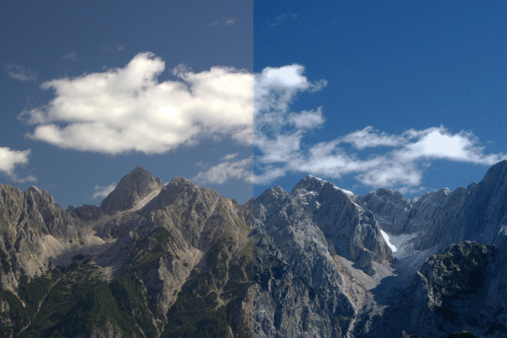

# 3D LUT Cube Files

## Functions Used

- [lut_translate()](../../../lut.c)

## Result



## Implementation

[examples/apply_lut.c](../../../examples/apply_lut.c)

## Example

Apply color grading using 3D Look-Up Tables. 

```
  /**
   * Read the source image.
   */
  layer_t source = read_JPEG_file(argv[1]);
  layer_info(source);

  /**
   * Read lookup table from the cube file.
   */
  lut_t lut;
  _Bool ok = read_lut(argv[2], &lut);
  if(!ok) {
    fprintf(stderr, "Can't read lut from %s\n", argv[2]);
    exit(EXIT_FAILURE);
  }

  /**
   * Apply color grading using LUT and save result.
   */
  rect_t adjust_zone = { source.width >> 1, 0, source.width, source.height };
  lut_translate(source, lut, adjust_zone, True);
  write_JPEG_file("apply-lut-result.jpg", source, 90);
```

