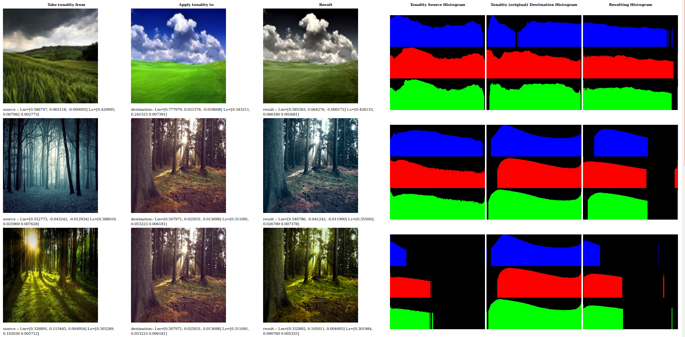

# Color Transfer Reinhard et al, 2001

## Credits

* https://www.cs.tau.ac.il/~turkel/imagepapers/ColorTransfer.pdf

## Functions Used

- [apply_color_reinhard2001()](../../../reinhard2001.c)

## Result



## Implementation

[examples/apply_color_reinhard2001.c](../../../examples/apply_color_reinhard2001.c)

## Example
```c
  /**
   * Read the source image to take the tonality from
   */
  layer_t source = read_JPEG_file(argv[1]);
  layer_info(source);

  /**
   * Read the destination image to change the tonality.
   */
  layer_t dest = read_JPEG_file(argv[2]);
  layer_info(dest);
  save_histogram("histogram-original.jpg", dest);

  /**
   * Apply tonality from source to dest.
   */
  apply_color_reinhard2001(source, dest, source.zone, dest.zone, 1.0f /*variance*/, 1.0f /*mean*/);
  write_JPEG_file("apply-color-reinhard.jpg", dest, 90);
```
