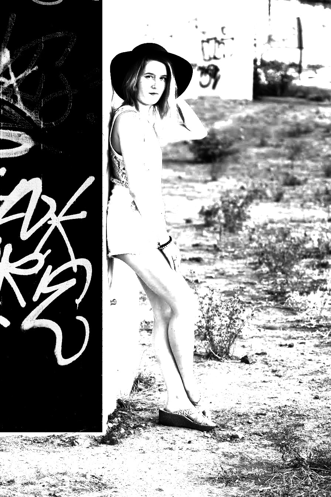

# Comics (B&W)

## Credits

 * https://pastebin.com/pGL6jdkm

## Functions Used

- [comics_filter()](../../../comics.c)
- [invert()](../../../invert.c)

## Original 


## Result


## Implementation

[examples/comics-example.c](../../../examples/comics-example.c)

## Example
```c
  /**
   * Read the source image
   */
  layer_t source = read_JPEG_file(argv[1]);
  layer_info(source);

  rect_t adjust_zone = { 0, 0, source.width, source.height };
  rect_t invert_zone = { 0, 0, source.width*0.31f, source.height*0.87f };
  comics_filter(source, adjust_zone);
  invert(source, invert_zone);
  write_JPEG_file("comics-result.jpg", source, 90);
```

