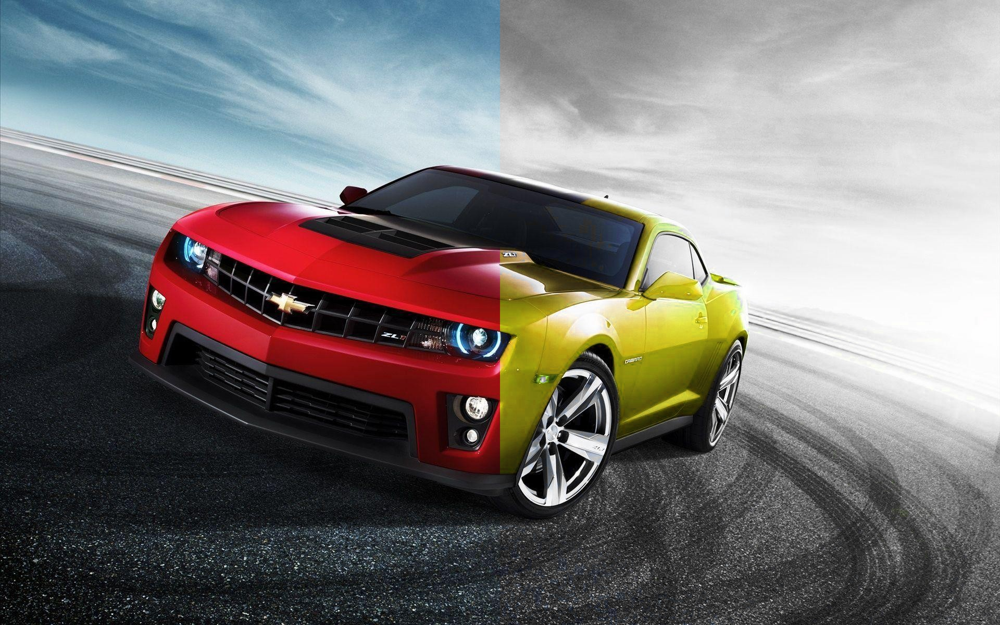

# Recolor and Desaturate Example

## Functions Used
 
- [replace_color()](../../../color_balance.c)
- [adjust_color_saturation()](../../../color_balance.c)


## Result



## Implementation

* [examples/replace_color.c](../../../examples/replace_color.c)

## Example

```c
  /**
   * Read the red car image.
   */
  layer_t red_car = read_JPEG_file(argv[1]);
  layer_info(red_car);

  rect_t adjust_zone = { red_car.width >> 1, 0, red_car.width, red_car.height };


  /**
   * Adjust saturation of all colors except red.
   */
  adjust_color_saturation(
     red_car, 
     0.0f, -1.0f, -1.0f, -1.0f, 0.0f, -1.0f, /* hue saturation */
     0.0f, 0.0f, 0.0f, 0.0f, 0.0f, 0.0f,  /* lightness */
     adjust_zone);

  /**
   * Take red color and shift it to yellow.
   */
  replace_color(
    red_car,
    0.1666f,
    0.0f, 
    0.0f, 
    0.0f,
    0.0f,
    0.0f,
    adjust_zone
  );


  write_JPEG_file("red-car.jpg", red_car, 90);

```


