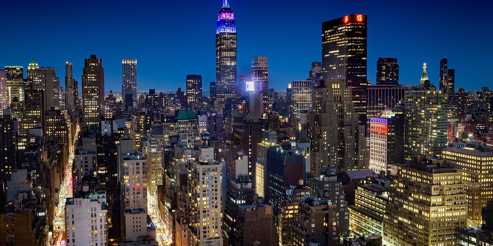
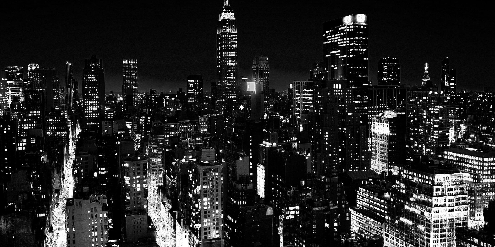

# Sincity Filter

Black&White and also colorized implementation

## Credits

 * https://pastebin.com/zVxsZBVG

## Functions Used

- [sincity_filter()](../../../sincity.c)

## Original 


## Result


## Implementation

[examples/sincity.c](../../../examples/sincity.c)

## Example
```c
  /**
   * Read the source image
   */
  layer_t source = read_JPEG_file(argv[1]);
  layer_info(source);

  rect_t adjust_zone = { 0, 0, source.width, source.height };
  sincity_filter(source, adjust_zone, false);
  write_JPEG_file("sincity-result.jpg", source, 90);
```

