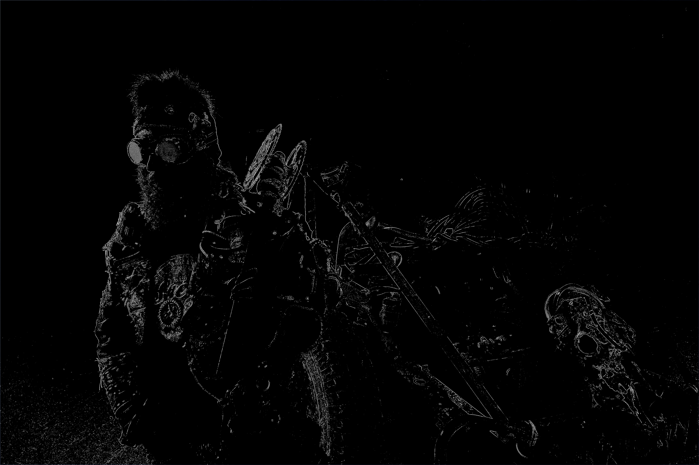

# Laplace Filter

## Credits

* Junktown

## Functions Used

- [laplace()](../../../laplace.c)

## Original 


## Result


## Implementation

[examples/laplace.c](../../../examples/laplace.c)

## Example
```c
  /**
   * Read the source image
   */
  layer_t source = read_JPEG_file(argv[1]);
  layer_info(source);

  rect_t adjust_zone = { 0, 0, source.width, source.height };
  gauss(source, 3, 1.5f, adjust_zone, False);
  laplace(source, adjust_zone, false);
  write_JPEG_file("laplace-result.jpg", source, 90);
```

